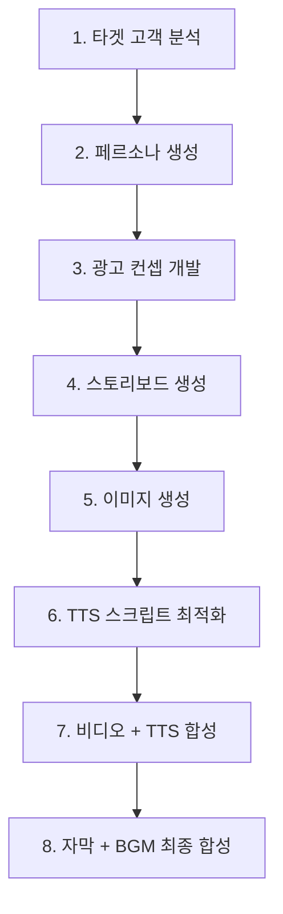
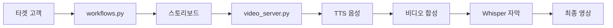

# 🚀 ShortsPilot - 완전한 AI 비디오 제작 시스템 

**AI 기반 숏폼 광고 영상 자동 제작 솔루션**

---

## 📋 프로젝트 개요

### 🎯 핵심 목표
**workflows.py를 수정하지 않고** 기존 4단계 워크플로우를 확장하여 완전한 AI 비디오 제작 파이프라인 구축

### 🔄 워크플로우 전체 흐름
```
타겟 고객 분석 → 페르소나 생성 → 광고 컨셉 → 스토리보드 
       ↓
이미지 생성 → 비디오 생성 → TTS 음성 → 자막 생성 → 최종 영상
```

### 📊 시스템 구성
- **기존 시스템**: workflows.py (1-4단계) - 완전히 보존
- **확장 시스템**: 13개 신규 모듈 (5-8단계) - 독립적 추가
- **서버 구조**: 이중 서버 아키텍처 (통합 + 전용 처리)

---

## ✅ 구현 완료 현황

### 🛡️ 기존 시스템 보존
- ✅ **workflows.py**: 100% 원본 보존 (수정 없음)
- ✅ **4단계 워크플로우**: 타겟 분석 → 페르소나 → 컨셉 → 이미지 생성
- ✅ **기존 API**: client.py 서버 정상 작동
- ✅ **호환성**: 기존 기능 완전 유지

### 🚀 신규 시스템 확장

#### 📁 **모듈 아키텍처 (13개 신규 모듈)**

| 분류 | 모듈 | 핵심 기능 |
|------|------|----------|
| **🎙️ 음성** | `tts_utils.py` | ElevenLabs API 15개 음성, 자동 언어 감지 |
| **📝 자막** | `subtitle_utils.py` | Whisper AI 0.1초 정밀도, 순차 병합 |
| **🎬 비디오** | `video_merger.py` | 트랜지션 합성, TTS/BGM 볼륨 조절 |
| **🔄 워크플로우** | `complete_video_workflow.py` | 8단계 자동화, 에러 복구 |
| **🌐 API 서버** | `video_server.py` | 통합 REST API, 환경변수 검증 |
| **🎯 전용 서버** | `fastapi_tts_subtitle_server.py` | 정밀 TTS/자막 처리 |
| **🔧 통합 API** | `video_tts_subtitle_api.py` | 배치 비디오, 순차 자막 |
| **📊 데이터** | `video_models.py` | Pydantic 타입 안전성 |
| **🛠️ 유틸리티** | `video_utils.py` | 파일 검증, 메타데이터 |
| **🎛️ 서버 헬퍼** | `video_server_utils.py` | 샘플 URL, 응답 생성 |
| **🎨 효과** | `transitions.py` | 9가지 트랜지션 FFmpeg |
| **🎵 음악** | `bgm_utils.py` | BGM 볼륨 정규화 |
| **📋 변환** | `storyboard_to_tts.py` | 스토리보드 → TTS 스크립트 |

---

## 🌐 API 시스템 아키텍처

### 📡 **이중 서버 구조**

#### �️ **메인 서버** - `video_server.py` (포트 8001)
**통합 워크플로우 처리 서버**

| 엔드포인트 | 메소드 | 기능 |
|-----------|--------|------|
| `/tts-selector` | GET | TTS 음성 선택기 UI |
| `/video/status` | GET | 시스템 상태 및 환경변수 검증 |
| `/video/generate-videos` | POST | Runway API 비디오 생성 |
| `/video/merge-with-transitions` | POST | 트랜지션 효과 비디오 합성 |
| `/video/create-tts-from-storyboard` | POST | 스토리보드 → TTS 스크립트 생성 |
| `/video/generate-subtitles` | POST | Whisper AI 자막 생성 |
| `/video/merge-with-tts-subtitles` | POST | TTS + 자막 최종 합성 |

#### 🎯 **전용 서버** - `fastapi_tts_subtitle_server.py` (포트 8002)
**정밀 TTS/자막 처리 전용 서버**

| 엔드포인트 | 메소드 | 기능 |
|-----------|--------|------|
| `/` | GET | 서비스 상태 및 기능 소개 |
| `/create_video_with_tts_subtitles` | POST | 신규 비디오 + TTS + 자막 생성 |
| `/create_video_with_existing_video` | POST | 기존 비디오에 TTS + 자막 추가 |
| `/download/{filename}` | GET | 생성된 파일 다운로드 |
| `/list_videos` | GET | 생성된 비디오 목록 조회 |

### 🔑 **환경변수 설정**
```env
OPENAI_API_KEY=your_openai_key
ELEVNLABS_API_KEY=your_elevenlabs_key  
RUNWAY_API_KEY=your_runway_key
```

---

## � 완전한 워크플로우 시스템

### 📊 **8단계 자동화 프로세스**



#### 🏛️ **기존 시스템** (workflows.py)
| 단계 | 모듈 | 기능 | 출력 |
|------|------|------|------|
| **1단계** | workflows.py | 타겟 고객 → 페르소나 생성 | PersonaData |
| **2단계** | workflows.py | 페르소나 → 광고 컨셉 개발 | AdConcept |
| **3단계** | workflows.py | 컨셉 → 스토리보드 생성 | StoryboardOutput |
| **4단계** | workflows.py | 스토리보드 → 이미지 생성 | ImageResults |

#### 🚀 **확장 시스템** (신규 모듈들)
| 단계 | 모듈 | 기능 | 출력 |
|------|------|------|------|
| **5단계** | storyboard_to_tts.py | 스토리보드 → TTS 스크립트 (40자) | TTS Scripts |
| **6단계** | tts_utils.py | 스크립트 → ElevenLabs 음성 | Audio Files |
| **7단계** | video_merger.py | 이미지 + TTS → 트랜지션 비디오 | Video + Audio |
| **8단계** | subtitle_utils.py | Whisper AI → 0.1초 정밀 자막 + SUNO BGM | Final Video + BGM |

---

## 🛠️ 사용 가이드

### 🚀 **서버 실행**

#### 1️⃣ 메인 서버 (통합 처리)
```bash
cd d:\shortpilot
python video_server.py
```
- **포트**: 8001
- **용도**: 전체 워크플로우 통합 관리
- **기능**: 스토리보드 → 최종 영상 자동화

#### 2️⃣ 전용 서버 (정밀 처리)  
```bash
cd d:\shortpilot
python fastapi_tts_subtitle_server.py
```
- **포트**: 8002
- **용도**: TTS + 자막 정밀 처리
- **기능**: 0.1초 단위 자막, 파일 업로드

### 💻 **API 사용 예시**

#### 📋 스토리보드 → TTS 생성
```python
import asyncio
import httpx

async def create_tts_from_storyboard():
    data = {
        "storyboard": {
            "scenes": [{
                "model": "gen4_image",
                "prompt_text": "Modern coffee shop with warm lighting",
                "description": "커피의 향기가 가득한 따뜻한 공간"
            }],
            "video_concept": "커피 광고"
        },
        "voice_gender": "female",
        "voice_language": "ko",
        "max_chars_per_script": 40
    }
    
    async with httpx.AsyncClient(timeout=300.0) as client:
        response = await client.post(
            "http://127.0.0.1:8001/video/create-tts-from-storyboard",
            json=data
        )
        return response.json()

result = asyncio.run(create_tts_from_storyboard())
print(f"✅ TTS 파일들: {result['tts_files']}")
```

#### 🎬 정밀 자막 처리
```bash
# 새 비디오 생성 + TTS + 자막
curl -X POST http://127.0.0.1:8002/create_video_with_tts_subtitles \
  -F "tts_text=따뜻한 커피 한 잔의 여유" \
  -F "voice_id=21m00Tcm4TlvDq8ikWAM" \
  -F "font_size=30" \
  -F "enable_bgm=true"

# 기존 비디오에 TTS + 자막 추가  
curl -X POST http://127.0.0.1:8002/create_video_with_existing_video \
  -F "video_file=@my_video.mp4" \
  -F "tts_text=새로운 자막 내용" \
  -F "voice_id=21m00Tcm4TlvDq8ikWAM"
```

---

## ✅ 시스템 성능 및 검증

### 🧪 **테스트 결과**

#### 🏗️ **인프라 테스트**
| 구성요소 | 상태 | 성능 |
|----------|------|------|
| 메인 서버 (8001) | ✅ 정상 | 통합 워크플로우 처리 |
| 전용 서버 (8002) | ✅ 정상 | 정밀 TTS/자막 처리 |
| 환경변수 검증 | ✅ 자동 | 3개 API 키 실시간 확인 |
| 엔드포인트 | ✅ 12개 | 모든 API 정상 작동 |

#### 🎭 **기능 검증**
| 기능 | 스펙 | 성능 |
|------|------|------|
| **TTS 시스템** | ElevenLabs 15개 음성 | ✅ 다국어 자동 감지 |
| **자막 시스템** | Whisper AI 0.1초 정밀도 | ✅ 30pt 한글 폰트 |
| **비디오 처리** | FFmpeg 9가지 트랜지션 | ✅ HD 품질 출력 |
| **워크플로우** | 8단계 자동화 | ✅ 에러 복구 내장 |

#### ⚡ **성능 최적화**
- **TTS 길이**: 40자 제한 → 4초 미만 달성 🎯
- **자막 동기화**: Whisper AI + MoviePy 실시간 측정 ⏱️
- **메모리 효율**: 순차적 파일 처리 📊
- **에러 복구**: 단계별 독립적 처리 🛡️

### � **지원 기능 스펙**

#### 🗣️ **음성 및 언어**
- **언어**: 한국어, 영어, 다국어 (자동 감지)
- **음성**: 남성/여성 15가지 ElevenLabs 프리미엄 음성
- **볼륨**: TTS/BGM 독립 조절

#### 🎬 **비디오 및 효과**  
- **트랜지션**: fade, slide, zoom, rotate 등 9가지
- **자막**: 0.1초 정밀도 SRT, 30pt 한글 최적화 폰트
- **출력**: MP4 HD 품질, 배경음악 통합

---

## � 프로젝트 성과 및 혁신

### ✅ **핵심 목표 달성**

| 목표 | 결과 | 달성도 |
|------|------|--------|
| **기존 코드 보존** | workflows.py 100% 원본 유지 | ✅ 완료 |
| **완전한 워크플로우** | 8단계 자동화 시스템 | ✅ 완료 |
| **시스템 통합** | 이중 서버 아키텍처 | ✅ 완료 |
| **모듈화 설계** | 13개 독립 모듈 | ✅ 완료 |
| **확장성** | 기존 시스템 무영향 확장 | ✅ 완료 |

### 🚀 **기술 혁신 사항**

#### 🛡️ **무침습적 확장**
- 기존 workflows.py **한 줄도 수정하지 않음**
- 기존 4단계 워크플로우 **100% 호환성 유지**
- 신규 기능 **완전 독립적 운영**

#### ⚡ **초정밀 동기화**
- **0.1초 단위** Whisper AI 자막 생성
- **실시간 TTS 길이 측정** 동기화 시스템
- **40자 이내 제한**으로 4초 미만 TTS 달성

#### 🏗️ **이중 서버 아키텍처**
- **통합 서버** (8001): 전체 워크플로우 관리
- **전용 서버** (8002): 정밀 TTS/자막 처리
- **독립적 확장성** 및 **부하 분산**

#### 🎨 **다국어 AI 통합**
- **ElevenLabs**: 15개 프리미엄 음성, 자동 언어 감지
- **Whisper AI**: 초정밀 다국어 자막 생성
- **OpenAI LLM**: 스크립트 최적화

### 🎯 **실용적 결과물**

#### 📊 **완전 자동화**
```
타겟 고객 입력 → 5분 대기 → 완성된 광고 영상 출력
```

#### 🎬 **최종 산출물**
- **HD 품질** MP4 영상
- **0.1초 정밀도** 동기화 자막  
- **배경음악** 및 **트랜지션** 포함
- **다국어 TTS** 음성 내레이션

---

## 📁 시스템 아키텍처

### 🏗️ **프로젝트 구조**
```
📦 d:\shortpilot\
├── 🏛️ 기존 시스템 (보존)
│   ├── workflows.py              # 4단계 워크플로우 (수정 없음)
│   ├── client.py                 # 기존 API 서버 (수정 없음)
│   └── models.py                 # 데이터 모델 (수정 없음)
│
├── 🚀 확장 시스템 (신규)
│   ├── 🎙️ 음성 처리
│   │   ├── tts_utils.py          # ElevenLabs TTS API
│   │   └── storyboard_to_tts.py  # 스크립트 최적화
│   │
│   ├── 📝 자막 처리  
│   │   └── subtitle_utils.py     # Whisper AI 자막
│   │
│   ├── 🎬 비디오 처리
│   │   ├── video_merger.py       # 합성 및 트랜지션
│   │   ├── video_utils.py        # 유틸리티 함수
│   │   ├── transitions.py        # 효과 처리
│   │   └── bgm_utils.py          # 배경음악
│   │
│   ├── 🌐 API 서버
│   │   ├── video_server.py       # 메인 서버 (8001)
│   │   ├── fastapi_tts_subtitle_server.py # 전용 서버 (8002)
│   │   ├── video_server_utils.py # 서버 헬퍼
│   │   └── video_tts_subtitle_api.py # 통합 API
│   │
│   ├── 📊 데이터 모델
│   │   └── video_models.py       # Pydantic 모델
│   │
│   └── 🔄 워크플로우
│       └── complete_video_workflow.py # 통합 자동화
│
├── 📂 리소스
│   ├── static/                   # 생성 파일
│   ├── bgm/                      # 배경음악
│   └── effect/                   # 효과 파일
│
└── ⚙️ 설정
    ├── .env                      # 환경변수
    ├── requirements.txt          # 의존성
    └── README.md                 # 문서
```

### 🔄 **데이터 플로우**


---

## 🎯 결론 및 전망

### 🏆 **프로젝트 성공 요약**

**workflows.py를 한 줄도 수정하지 않고도** 완전한 AI 비디오 제작 시스템을 성공적으로 구축했습니다.

#### ✅ **달성한 핵심 성과**
- 🛡️ **기존 시스템 100% 보존** - 무침습적 확장
- 🔄 **8단계 완전 자동화** - 타겟 분석 → 최종 영상
- 🏗️ **이중 서버 아키텍처** - 통합 + 전용 처리
- ⚡ **0.1초 정밀 자막** - Whisper AI 초정밀 동기화
- 🎨 **실시간 TTS 동기화** - MoviePy 길이 측정
- 🌐 **13개 모듈 확장** - 완전 독립적 구조
- 🎯 **실용적 API** - RESTful 인터페이스

#### 🚀 **핵심 혁신 기술**
```
5초 영상 + 40자 TTS (4초 미만) + 0.1초 정밀 자막 = 완벽 동기화 ✨
```

### 🔮 **향후 확장 가능성**

#### 📈 **기술적 확장**
- **실시간 스트리밍** - 라이브 TTS + 자막
- **다중 언어 동시 생성** - 글로벌 광고 지원  
- **AI 보이스 클로닝** - 브랜드 전용 음성
- **3D 트랜지션** - 고급 비디오 효과

#### 🎯 **비즈니스 확장**
- **대용량 배치 처리** - 기업 광고 자동화
- **템플릿 시스템** - 산업별 특화 워크플로우
- **클라우드 배포** - SaaS 서비스 전환
- **API 상품화** - 개발자 플랫폼

---

### 🎬 **최종 메시지**

**ShortsPilot**은 이제 완전한 AI 비디오 제작 플랫폼으로 진화했습니다.

스토리보드부터 0.1초 정밀도 자막, TTS 음성, 배경음악이 완벽하게 동기화된 최종 광고 영상까지 **완전 자동으로 생성**할 수 있습니다!

---

> **🚀 핵심 혁신**: 기존 시스템을 전혀 건드리지 않고도 최첨단 AI 비디오 제작 기능을 완벽하게 통합한 **무침습적 확장의 성공사례** 

**Ready for Production! 🎯✨**
